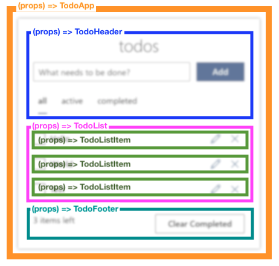

# Step 2.4 - React Context (Demo)

[Lessons](../) | [Exercise](./exercise/) | [Demo](./demo/)

In this step, we describe some problems we encounter when creating a more complex application.

We will solve these problems with the React Context API. The Context API consists of:

1. Provider component
2. Consuming context from a Class Component
3. Consuming context from a Functional Component

---

React represents a single component like this:

```
(props) => view;
```

In a real application, these functions are composed. It looks more like this:



## Problems in a Complex Application

1. Data needs to be passed down from component to component via props. Even when some components do not need to know about some data. This is a problem called **props drilling**

2. There is a lack of coordination of changes that can happen to the data

Even in our simple application, we saw this problem. For example, `<TodoList>` has this props interface:

```ts
interface TodoListProps {
  complete: (id: string) => void;
  remove: (id: string) => void;
  todos: Store['todos'];
  filter: FilterTypes;
  edit: (id: string, label: string) => void;
}
```

All of these props are not used, except to be passed down to a child Component, `TodoListItem`:

```js
<TodoListItem todos="{todos}" complete="{complete}" remove="{remove}" edit="{edit}" />
```

## Context API

Let's solve these problems with the React Context API. _context_ is React's way to share data from components to their descendant children components without explicitly passing down through props at every level of the tree. React context is created by calling `createContext()` with some initial data. Use the `<TodoContext.Provider>` component to wrap a part of the component tree that should be handed the _context_.

```js
// To create a completed empty context
const TodoContext = React.createContext(undefined);

class TodoApp extends React.Component {
  render() {

    // Pass in some state and function to the provider's value prop
    return (
      <TodoContext.Provider
        value={{
          ...this.state,
          addTodo={this._addTodo},
          setFilter={this._setFilter},
          /* same goes for remove, complete, and clear */
        }}>
        <div>
          <TodoHeader />
          <TodoList />
          <TodoFooter />
        </div>
      </TodoContext.Provider>
    );
  }
}
```

### Consume _context_ from a Class Component

Inside the children components, like the `<TodoHeader>` component, the value can be access from the component's `context` prop like this:

```js
class TodoHeader extends React.Component {
  render() {
    // Step 1: use the context prop
    return <div>Filter is {this.context.filter}</div>;
  }
}

// Step 2: be sure to set the contextType property of the component class
TodoHeader.contextType = TodoContext;
```

### Consume _context_ from a Functional Component

If you're using the functional component syntax, you can access the context with the `useContext()` function. `useContext()` requires a recent release of React (16.8):

```js
const TodoFooter = props => {
  const context = useContext(TodoContext);
  return (
    <div>
      <button onClick={context.clear()}>Clear Completed</button>
    </div>
  );
};
```
