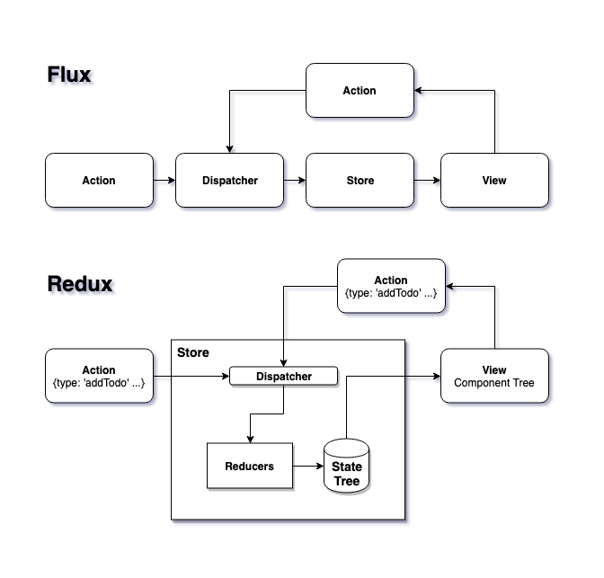

# Step 2.5: Redux: Reducers

[Lessons](../) | [Exercise](./exercise/) | [Demo](./demo/)

## Flux

Ideally React gives us a mental model of:

```
f(data) => view
```

This is fine if the data never changes. However, React exists to deal with data updates via props (immutable) and state (changes based on `setState()` API). In the real world, data is shaped like a tree and view is shaped like a tree. They don't always match.

Facebook invented the [Flux](https://facebook.github.io/flux/) architectural pattern to solve this shared state issue. [Redux](https://redux.js.org/) is an implementation of Flux.

Redux is used inside many large, complex applications because of its clarity and predictability. It is really easy to debug and is easily extensible via its middleware architecture. In this lesson, we'll explore the heart of how Redux modifies state.

Redux expects the data (store) to be a singleton state tree. It listens for messages to manipulate the state and passes updates down to views.



### View

A view is a React components that consumes the store as its data. There is a special way Redux will map its data from the state tree into the different React components. The components will know to re-render when these bits of state are changed.

### Action

Actions are messages that represent some event, such as a user's action or a network request. With the aid of *reducers*, they affect the overall state.

### Store

The store contains a singleton state tree. The state tree is immutable and needs to be re-created at every action. This helps connected views easily to know when to update by allowing them to do a simple reference comparison rather than a deep comparison. You can think of each state as a snapshot of the app at that point in time.

### Dispatcher

There is a single dispatcher. It simply informs the store of all the actions that need to be performed. Additional middleware (explained later) can be applied to the store, and the dispatcher's job is to dispatch the message through all the middleware layers.

### Reducers

Redux uses **reducers** to manage state changes. This name comes from the "reducer" function passed to `Array.reduce()`.

A Redux reducer is a simple stateless **pure function** (no side effects). Its only job is to change the state from one immutable snapshot to another. It takes state + an action message as input, makes a modified copy of the state based on the action message type and payload, and returns the new state. (Reducers should not modify the previous state.)

**Mental Model**: Think of a reducer as part of the store. It should have no side effects and only define how data changes from one state to the next given action messages.

### Advanced: Middleware

From the [documentation site](https://redux.js.org/advanced/middleware):

> Redux middleware provides a third-party extension point between dispatching an action, and the moment it reaches the reducer.

We won't be covering middleware much in these lessons since it's a more advanced topic.

## Getting started with Redux

We begin the journey into Redux by looking at the store. The store consists of several parts:

1. **State/data** - We represent this both with an initial state and with a TypeScript interface.
2. **Reducers** - Responsible for reacting to action messages to change from a previous to the next state.
3. **Dispatcher** - There should be only one dispatcher, which is exported by the store. We'll look at this in Step 6!

### Create store

The `createStore()` function is provided by Redux and can take in several arguments. The simplest form just takes in reducers.

```ts
const store = createStore(reducer);
```

`createStore()` can also take in an initial state. There are two common sources for the initial state:

1. Load initial data from a server
2. Load data that is generated by a server-side rendering environment

```ts
const store = createStore(reducer, {
  /* the initial state */
});
```

`createStore()` can take a third argument that injects middleware, but we won't use this until later.

### Reducers

Remember that the reducers are **pure**. Pure functions have no side effects. They always return the same output given the same input (idempotent). They are easily testable.

Reducers looks at the action message to decide what to do to the state. A convention established in the Flux community is that the action message (payload) should include a `type` key. Another convention is using switch statements against the `type` key to trigger further reducer functions.

```ts
function reducer(state: Store['todos'], payload: any): Store['todos'] {
  switch (payload.type) {
    case 'addTodo':
      return addTodo(state, payload.id, payload.label);
  }

  return state;
}
```

In these demo and exercises, I separated the pure & reducer functions into different files to make it cleaner. The tests inside `pureFunctions.spec.ts` should describe the behavior of the individual functions. They are easy to follow and easy to write.

# Exercise

If you still have the app running from a previous step, stop it with `ctrl+c`.  Start the tests instead by running `npm test` from the root of the `frontend-bootcamp` folder.

1. First, take a look at the store interface in `exercise/src/store/index.ts`. Note that the `Store` interface has two keys: `todos` and `filter`. We'll concentrate on `todos`, which is an object where the keys are string IDs and the values are of a `TodoItem` type.

2. Open `exercise/src/reducers/pureFunctions.ts` and fill in the missing function bodies.

3. Open `exercise/src/reducers/index.ts` and fill in the missing case statements for the switch on `action.type`.

4. Open `exercise/src/reducers/pureFunctions.spec.ts` and implement tests for the functions you wrote for `remove`, `complete`, and `clear`.
